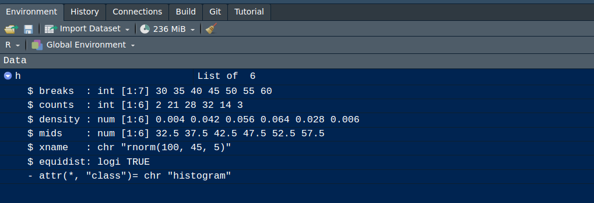

<br/>

<br/><br/>

A manera de introducción a  continuación se relacionan algunas ayudas para la iniciación del lenguaje :

<br/><br/>


<center>
**Tabla 3.1**  Tipos de objetos 

| Objeto      | tipos                                          | permite varios tipos? |
|:------------|:-----------------------------------------------|:----------------------|
|  vector     | numéricos, caracter, complejo, lógico          | No                    |
|  factor     | numérico, caracter                             | No                    |
|  arreglo    | numéricos, caracter, complejo, lógico          | No                    |
|  matriz     | numéricos, caracter, complejo, lógico          | No                    |
|  data.frame | numéricos, caracter, complejo, lógico          | Si                    |
|  ts         | numéricos, caracter, complejo, lógico          | Si                    |
|  lista      | numéricos, caracter, complejo, lógico, función, expresión  | Si        |

<sub>
Tomado de: [R para principiantes](https://bookdown.org/jboscomendoza/r-principiantes4/) 
</sub>
</center>


<br/><br/>

A continuación se presentan algunos ejemplos de objetos

<br/><br/>

## <span style="color:#034A94">**vector**</span>  

Arreglo unidimensional de valores, caracteres o cadenas, todos del mismo tipo


### <span style="color:#FF7F00">**Ejemplo**</span>


```{r}
x=c(1,2,3,4,5)  
x
```


```{r}
y=c("Muy regular", "Regular", "Bueno", "Muy bueno", "Excelente")    
y
```


<br/><br/>

## <span style="color:#034a94">**matriz**</span> 

Arreglo bidimensional de valores


```{r}
x=1:9

m=matrix(x,nrow=3)   # <<-
m
```


<br/><br/>

## <span style="color:#034a94">**arrays**</span>  

Arreglos multimensionales de valores. 
En el siguiente ejemplo se representa un arreglo de 3 matrices 3x3 que conformarían en 3D un cubo de datos


```{r}
x=1:9
y=10:18
z=19:27

mn=array(c(x,y),dim=c(3,3,3)) # <<-
mn
```


<br/><br/>

## <span style="color:#034a94">**factores**</span> 

Vector de variables categóricas, por lo general se utilizan para dividir una base en subgrupos  


```{r}
x=c("rojo", "verde", "azul")
y=rep(x, times=4)
y=as.factor(y)               # <<-
y
```

<br/><br/>

## <span style="color:#034a94">**listas**</span> 

Colección de objetos cada uno de tipos diferentes. El objeto de esta clase guarda valores en diferentes formatos. 

En el siguiente ejemplo se construye un objeto **h** que contiene varios elementos dentro de si, todos relacionados con un histograma


```{r}
h=hist(rnorm(100,45,5), col = "#FF7F00", main = "Distribución del tiempo de carrera K10", las=1, xlab = "tiempo en min", ylab ="frecuencia") 
```


```{r, echo=FALSE, out.width="100%", fig.align = "left"}

```


<br/><br/>

## <span style="color:#034a94">**data.frames**</span>

Estructura de datos de dos dimensiones - filas y columnas - base de datos. con la función `data()` se pueden cargar bases de datos contenidas en R.  `data(iris)` carga la base iris que contiene 150 registros (colomnas) y 5 variables (filas). 

```{r}
data(iris) # carga la data desde un paquete activado
head(iris) # presenta los primeros 6 registros
```


<br/><br/>

## <span style="color:#034a94">**funciones**</span>

Para construir una función utilizamos la palabra `function`, entre paréntesis los valores de entrada y entre corchetes la formula que conforma la función. Por ejemplo:


$$f(x)=\dfrac{1}{(x-1)^{2}}$$
$f(4.5) = ?$

```{r}
fx=function(x){1/(x-1)^2} # <<-
fx(4.5)
```


<br/>

En este caso la función es evaluada dentro de un otra función en la construcción de un gráfico

<br/>


```{r}
fx=function(x){1/(x-1)^2} 
x=seq(from=2,to=10, by=0.01)  # genera secuencia de numeros entre 2 y 10 con paso 0.01
plot(x, fx(x), type="l", col="#FF7F00", lwd = 2, las=1) # genera grafica
```

El siguiente ejemplo construye una función para la realización de un gráfico. En este caso los valores de entrada están conformados por un vector de datos y un color


<pre>
# funcion definida para la construcción de gráficos
grafica=function(x,color){
              barplot(x,col=color, las=1)
              }
</pre>


```{r, fig.width=8, fig.height=4}

# funcion definida para la construcción de gráficos
grafica=function(x,color){
	            barplot(x,col=color, las=1)
              }

y=sample(1:6,100, replace = T)  # generacion de datos

z=table(y) # generacion de tabla de datos
par(mfrow = c(1, 2)) # arma una matrix 1X2 de graficos
grafica(z,"#034A94")  # evalúa la función en los datos z y colo rojo
grafica(z,"#0EB0C6")
```

<br/><br/>

## <span style="color:#034a94">**ts**</span>

Los objetos `ts` corresponde a series temporales que están compuestos por un inicio, un final y una periodicidad temporal regular


```{r tidy=FALSE}
x=round(rnorm(285, 20,3),1) # datos sumulados
temperatura=ts(x,freq=12,start=c(2000,1))  # <<-
temperatura
```


<br/><br/><br/>


#  <span style="color:#034a94">**Operadores en R**</span>

<br/>

<center>
**Tabla 3.2**  Operadores lógicos

|      |Aritméticos         |      | Comparativos       |        | Lógicos     |
|:----:|:-------------------|:----:|:-------------------|:------:|:------------|
|  +   | adición            | <    | menor que          | !x     | NO lógico   |
|  -   | substracción       | >    | mayor que          | x & y  | Y lógico    |
|  *   | multiplicación     | <=   | menor o igual que  | x | y  | O lógico    |
|  /   | división           | >=   | mayor o igual que  | x or y | O exclusivo |
|  ^   | potencia           | ==   | igual              |        |             |
|  %%  | módulo             | !=   | diferente de       |        |             |
|  %/% | división enteros   |      |                    |        |             |

<sub>
Tomado de : [R para principiantes](https://bookdown.org/jboscomendoza/r-principiantes4/)
</sub>
</center>

<br/><br/><br/>

#  <span style="color:#034a94">**Algunas funciones útilies**</span>

<br/>

###  <span style="color:#034a94">**rep()**</span>

<pre>
rep(x,                # objeto a replicar 
    times = 1,        # número de veces que ser replica objeto
    length.out = NA,  # repetir el objeto las veces necesarias para crear vector de esta longitud
    each = 1)         # número de veces que se replica elementos individiales del objeto

</pre>

<br/>

### <span style="color:#FF7F00"> **Ejemplos**</span>

```{r}
vector= c("uno", "dos", "tres")
rep(vector, times=4)
```
 


<br/>


```{r}
vector= c("uno", "dos", "tres")
rep(vector, each=4)
```


<br/>


```{r}
vector= c("uno", "dos", "tres")
rep(vector, times=4,  length.out=7)
```

<br/><br/><br/>

###  <span style="color:#034A94">**seq()**</span>

<pre>
seq(from=0,             # valor inicial  
    to=10,               # valor final
    by=0.5,               # valor incremento
    length.out=NULL,    # longitud del secuencia   
    along.with=NULL)    # longitd del vector
</pre>


<br/>

### <span style="color:#FF7F00"> **Ejemplos**</span>

Secuencia de números enteros del 1 al 20

```{r}
seq(20)    # equivalente a 1:20
1:20
```

<br/>


Secuencia de números pares entre el 1 y el 20

```{r}
seq(2,20,2)
```


<br/>

Secuencia de números del 0 al 1 con incrementos de 0.1
```{r}
seq(0, 1, 0.1)
```


<br/><br/><br/>

###  <span style="color:#034a94">**round()**</span>

<pre>
round(x,             # valor  
      digits = 0)    # nmero de digitos
</pre>

<br/>

### <span style="color:#FF7F00"> **Ejemplos**</span>

Aprimar el valor de $\pi$ a 3 decimales

```{r}
pi
round(pi,3)    # aproxima a 3 decimales
```


<br/><br/><br/>

###  <span style="color:#034a94">**trunc()**</span>

Entrega la parte entera de un número

<br/>

### <span style="color:#FF7F00"> **Ejemplo**</span>

Sacar la parte entera de $\pi$

```{r}
trunc(pi)
```
