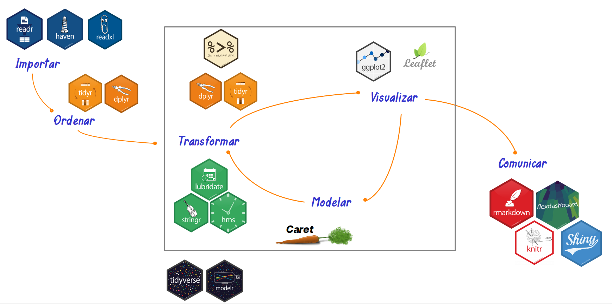
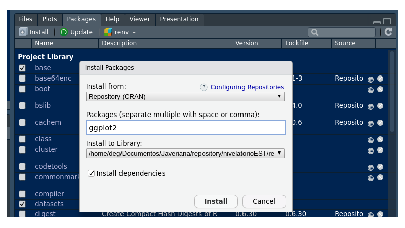
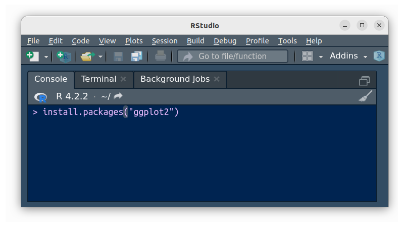

```{r setup, include=FALSE}
knitr::opts_chunk$set(echo = TRUE, comment = NA)
```


<br/><br/>

En R, los paquetes o packages son  colecciones de funciones, datos y código que se almacenan en una carpeta conforme a una estructura bien definida. Los paquetes pueden ser creados por usuarios individuales o por grupos de desarrolladores.

<br/>

Los paquetes se utilizan para extender la funcionalidad de R. Pueden proporcionar funciones para realizar tareas específicas, como importar y analizar datos, crear gráficos o implementar algoritmos de aprendizaje automático.

<br/>

La mayoría de los paquetes de R se almacenan en el sitio web CRAN (Comprehensive R Archive Network). CRAN es un repositorio de paquetes de R que se someten a un riguroso proceso de revisión antes de ser publicados.

<br/><br/>

## <span style="color:#034a94">**Algunios paquetes utilizados en Ciencia de Datos**</span>

Existe un gran número de paquetes que ayudan a los cientificos de datos a desarrollar diferentes actividades para cada una de las etapas que surgen en el manejo de los datos

<center>
```{r, echo=FALSE, out.width="100%", fig.align = "center"}

```
**Figura 3.3** Etapas de los datos y los paquetes empleados
</center>

<br/><br/>

<center>
**Tabla 3.3**  Paquetes utilizados en Ciencia de Datos 
<br/>

|    paquete   |                 |  descripción                                                            |
|:-------------|:----------------|:------------------------------------------------------------------------|
|`tidyverse`     |                 | colección de paquetes empleados en Ciencia de Datos                     |
|              | `ggplot2`         | crear gráficos a partir de capas o gramática de gráficos                | 
|              | `tibble`          | manejo de bases                                                         |
|              | `tidyr`           | crear bases de datos ordenadas                                          |
|              | `readr`           | leer archivos de texto plano como .csv                                  |
|              | `purrr`           | trabajar con vectores y funciones                                       |
|              | `dplyr`           | manipular datos : mutar, seleccionar, filtrar, resumir, organizar       |
|              | `stringr`         | trabajar con análisis de texto                                          |
|              | `forcats`         | trabajar con factores y datos categóricos                               |
| `readxl`     |      | leer archivos Excel                                                     |
| `haven`      |      | leer archivos SPSS. Stata, SAS                                          |
| `lubridate`  |      | fechas y tiempos                                                        |
| `hms`        |      | tiempo en horas, minutos, segundos                                      | 
|`summarytools`|      | exploración de datos, resumen descriptivos, tablas de frecuencia        |
|`psych`       |      | análisis psicométrico, análisis multivariado                            |
|`agricolae`   |      | análisis para investigación agrícola                                    |
|`devtools`    |      | desarrollo de paquetes en R                                             |
|`learnr`      |      | desarrollo de tutoriales en R                                           |
|`bookdown`    |      | escritura de libros, artículos e informes                               |
|`xaringan`    |      | creación de presentaciones HTML5                                        |
|`rmarkdown`   |      | crear documento desde R                                                 |
|`paqueteNIV`  |      | paquete del curso Nivelatorio de Estadística                            |
|              |      |                                                                         |

</center>

<br/><br/>


<div class="content-box-gray">
### <span style="color:#686868">**Nota**</span> 

La instrucción `installl.packages(tidyverse)`  instala los paquetes :

* `ggplot2` 
* `tibble`
* `tidyr` 
* `readr` 
* `purrr` 
* `dplyr` 
* `stringr`
* `forcats`

`library(tydyverse)`, los activa 
</div>
<br/><br/>


## <span style="color:#034a94">**Ventana help**</span>

<br/>

La función `help()`  permite la visualización de las ayudas relacionadas con una función en la ventana Help  que permite visualizar la sintaxis de las funciones. En el siguiente ejemplo la función help("install.packages") permite visualizar los parámetros de la función

```{r}
help("sum")
```


<br/><br/>

## <span style="color:#034a94">**Instalación de paquetes en R**</span>

<br/>

El lenguaje **R** esta conformado por miles de paquetes o **Packages** construidos por investigadores en diversos temas y área del conocimiento

Al instalar **R** se descargan con el programa una serie de paquetes para ser utilizados de manera inmediata. A este primer conjunto se llama **base** y permite dar respuesta a problemas básicos. Sin embargo en algunos casos es necesario instalar paquetes adicionales, los cuales iremos anunciando en la medida que sean necesario. ([paquetes más populares CRAN](https://gallery.shinyapps.io/087-crandash/))


La instalación de paquetes se puede hacer de dos formas : 

<br/><br/>

#### 1. Utilizando la ventana **Packages** ubicada en la parte inferior derecha de RStudio

<center>
```{r, echo=FALSE, out.width="60%", fig.align = "center"}

```
**Figura 3.4* Ventana Packages - instalación de paquetes
</center>

<br/><br/>

#### 2. Digitando directamente en la consola de R 

<center>
```{r, echo=FALSE, out.width="50%", fig.align = "center"}

```

**Figura 3.5** Ventana Terminal - función install.packages
</center>

<br/><br/>

##### Desde un repositorio en GitHub

Se puede descargar un paquete construido de manera particular y almacenado en github utilizando el paquete `devtools`

```{r, eval=FALSE}
devtools::install_github("dgonxalex80/paqueteNIV")
```

