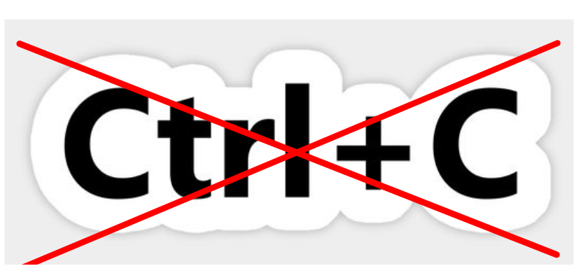
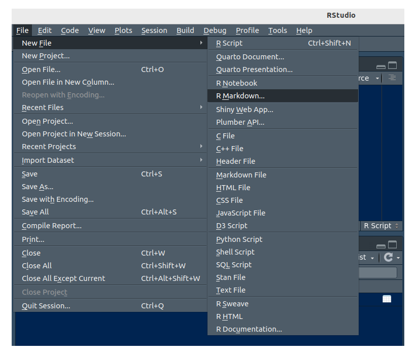
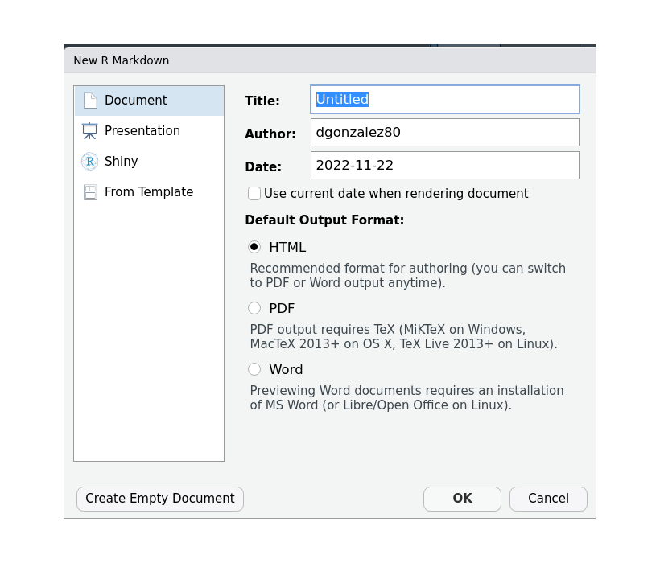
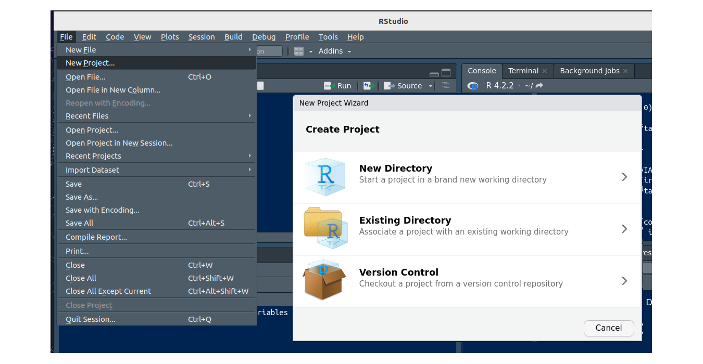
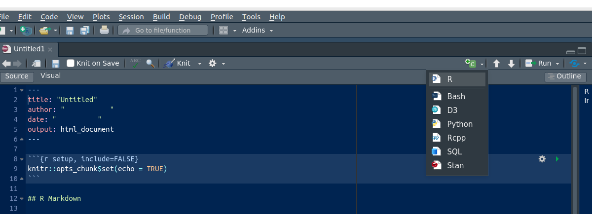
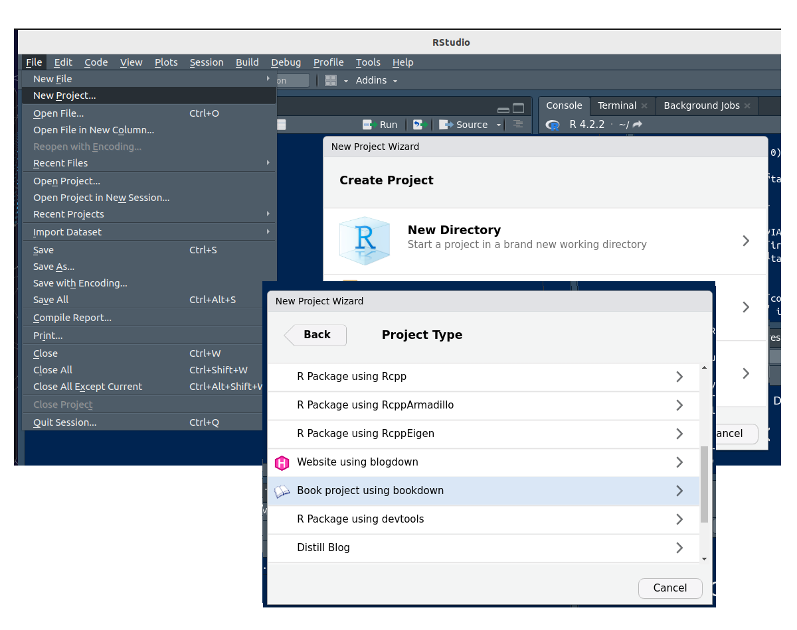
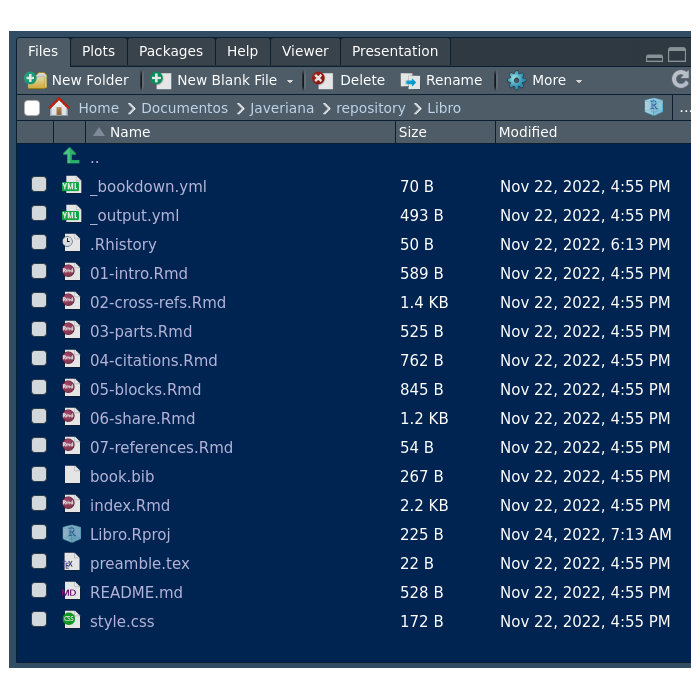
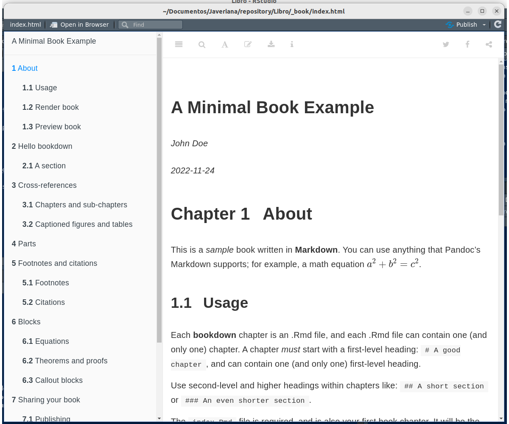

<br/><br/>

Una de las actividades principales al desarrollar proyectos en Ciencia de Datos ademas de los procesos de recolección y ajuste de datos y modelación consiste en poder comunicar de manera adecuada los resultados. Para ellos existen muchas posibilidades como pueden ser : artículos, libros, sitios web, posters, presentaciones y blogs entre otros 

Normalmente los procesos de importar, ajuste de los datos, la modelación, la representación gráfica se hace en programas diferentes a los que se utilizan para su publicación generando mas tiempo en en el proceso de comunicación pero haciendo popular el Ctrl+C , Ctrl+V

<br/>

```{r, echo=FALSE, out.width="10%", fig.align = "center"}

```
  

<br/><br/>

<div class="row">
  <div class="col-sm-2">
  

```{r, echo=FALSE, fig.align ='left'}
knitr::include_graphics("img/Rmd.jpeg")
```
</div>
<div class="col-sm-10">

El paquete rmarkdown junto a otros como : `knitr`, `bookdown`, `xaringan`, `blogdown`, entre otros permiten la construcción de documentos para comunicar los resultados obtenidos en un proceso 

</div>
</div>


<br/><br/>

<center>
```{r, echo=FALSE, out.width="100%", fig.align = "center"}
knitr::include_graphics("img/rmarkdown_universe.jpg")
```
<br/>
**Figura 3.5**  Interacción RStudio, Markdown , knitr para la construcción de documentos 
</center>

<br/><br/>

Para iniciar es necesario la instalación de los siguientes paquetes de R


```{r, eval=FALSE}
install.packages("rmarkdown")
install.packages("bookdown")
install.packages("xaringan")
install.packages("blogdown")
```


* **rmarkdown**
* **bookdown**
* **xaringam**
* **blogdwn**

<br/><br/>


## <span style="color:#034a94">**Formato Rmd**</span>

Para asceder a una plantilla Rmd ingresamos por :

<br/>

File / New File / R Marckdown ...

<center>
```{r, echo=FALSE, out.width="50%", fig.align = "center"}

```
<br/>
**Figura 3.6** Menú de documentos en RStudio
</center>

<br/>

Se depliega una ventana donde podemos colocar el nombre del documento 

<center>
```{r, echo=FALSE, out.width="50%", fig.align = "center"}

```
<br/>
**Figura 3.7** Ventana New RMarkdown para la creación de documentos
</center>
<br/>

En esta ventana se puede seleccionar el formato de la salida deseada en sus respectivos requerimientos:

+ HTML 
+ PDF  
+ Word 

Ademas de estos documentos existen plantillas que se activan al instalar paquetes como :

* `xarimgan` para crear presentaciones
* `bookdown` para crear libros


<br/><br/>

## <span style="color:#034a94">**Creación de proyectos**</span>

<br/>

Es recomendable crear un espacio para cada proyectos en su inicio,  con el fin de que todos los códigos, imágenes y ademas archivos queden asociados a una carpeta de tal forma que estén disponibles cuando se active el proyecto. 

<br/>

<center>
```{r, echo=FALSE, out.width="100%", fig.align = "center"}

```
<br/>
**Figura 3.8** Ventana New Project para la construcción de proyectos 
</center>


<br><br/>

Presentando tres opciones:

* **New Directory** : Cuando creamos un nuevo proyecto. Esta opción presenta varias plantillas 

* **Existing Directory** : Cuando tenemos un directorio ya creado y queremos ubicar nuestro proyecto en el

* **Version Control** : Esta opción se utiliza cuando queremos clonar un repositorio previamente creado en GitHub

<br/><br/>


<br/>

## <span style="color:#034a94">**Sintaxis Rmd**</span>

<br/><br/>

Los archivos creados a partir de la secuencia : `File / New File / R Marckdown ...` presenta una plantilla que ayuda a entender la sintaxis empleada en Rmd, la cual se puede mezclar con otros lenguajes como : `LaTeX`, `HTML`

[R Markdown::HOJA RESUMEN](https://rmarkdown.rstudio.com/lesson-15.HTML)

El lenguaje [Markdown](https://en.wikipedia.org/wiki/Markdown) es incorporado en RStudio mediante archivos .Rmd  y permite la escritura HTML, TeX. Tambien permite la creación de bloques intermedios donde se procesa código de : [R](https://www.r-project.org/), [Bash](https://es.wikipedia.org/wiki/Bash), [D3.js](https://en.wikipedia.org/wiki/D3.js), [Python](https://www.python.org/), [Rcpp](https://www.rcpp.org/),
[SQL](https://es.wikipedia.org/wiki/SQL) y [Stan](https://mc-stan.org/)

<br/><br/>

<center>
```{r, echo=FALSE, out.width="90%", fig.align = "center"}

```
<br/>
**Figura 3.9** Ventana para la creación de bloque de programación
</center>

<br/><br/>


## <span style="color:#034a94">**Plantilla para libro**</span>

<br/>

Es fácil construir un libro en Rmd : File / New Project.. / New Directory /  Book project using bookdown

<center>
```{r, echo=FALSE, out.width="100%", fig.align = "center"}

```
<br/>
**Figura 3.10** Ventana para la creación de proyectos
</center>

<br/><br/>

El proceso anterior crea un nuevo proyecto llamado **Libro** que contiene varios archivos

<br/><br/>


<center>
```{r, echo=FALSE, out.width="60%", fig.align = "center"}

```
<br/>
**Figura 3.11** Ventana de archivos generados por plantilla bookdown
</center>

<br/><br/>

Para procesar el libro convirtiéndolo en formato HTML o pdf se utiliza el botón Build Book ubicado en la ventana Build

<br/><br/>

<center>
```{r, echo=FALSE, out.width="70%", fig.align = "center"}

```
<br/>
**Figura 3.12** Documento en formato libro 
</center>


<br/><br/>

## <span style="color:#034a94">**Referencia**</span>

* [**R Markdown : The Definitive Guide**](https://bookdown.org/yihui/rmarkdown/)

