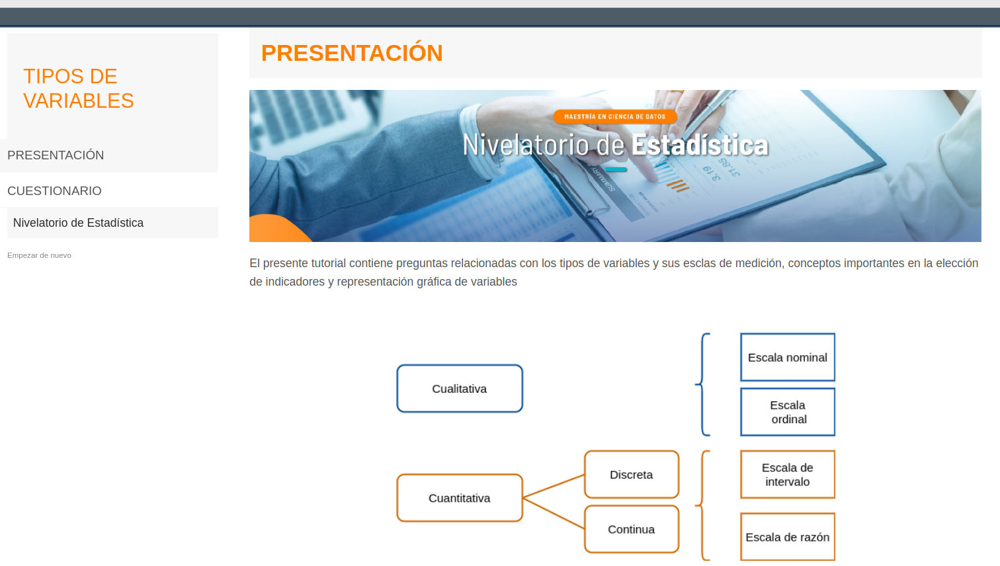

```{r setup, include=FALSE}
knitr::opts_chunk$set(echo = TRUE)
```

<br/><br/>

Los tutoriales constituyen una buena herramienta para el parendizaje de R, permitiendo realizar pruebas de opción multiple y tambien el aprendizaje la programación en R utilizando problemas que retan al usuario, brindando tambien apoyo mediante ayudas de código.

En este caso - Nivelatorio de Estadística - para asceder a los tutoriales realizar la instalación previa de  paqueteNIV que además de los tutotiales, contiene data y funciones.


<br/><br/>

### **Instalación de paqueteNIV**

<pre>
# se deben instalar los paquetes en caso de no haberlo hecho antes
install.packages("learnr") # solo una vez
install.packages('remotes')  # solo una vez

# codigo para cargar instructivo Taller_regresion1
library(remotes) 
library(devtools)  
install_github("dgonxalex80/paqueteNIV", force = TRUE) # instala  paqueteNIV
learnr::run_tutorial("tutorial101", "paqueteNIV") # correr instructivo 1
</pre>

```{r, eval=FALSE}
# se deben instalar los paquetes en caso de no haberlo hecho antes
install.packages("learnr") # solo una vez
install.packages('remotes')  # solo una vez

# codigo para cargar instructivo Taller_regresion1
library(remotes) 
library(devtools)  
install_github("dgonxalex80/paqueteNIV", force = TRUE) # instala  paqueteNIV
learnr::run_tutorial("tutorial101", "paqueteNIV") # aqctiva tutorial101

```

<br/><br/>

<div class="content-box-gray">
### **Nota**

En caso de presentar error al reinstalar paqueteNIV adicione el parametro : `force = TRUE`

<br/>

`devtools::install_github("dgonxalex80/paqueteNIV", force = TRUE)`

</div>

<br/><br/>

Después de la ejecución del código debe aparecer una página como la que se muestra en la siguiente figura 


```{r, echo=FALSE, out.width="100%", fig.align = "center"}

```
  

