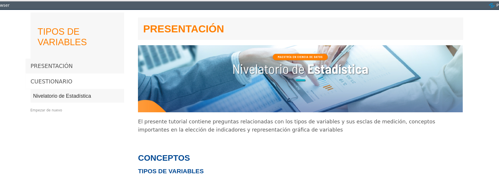

```{r setup, include=FALSE}
knitr::opts_chunk$set(echo = TRUE, comment = NA)
```

<br/><br/>

Durante los cursos:

* Nivelatorio de Estadística

* Métodos y Simulación Estadística

* Modelos Estadísticos para la toma de decisiones

* Series de tiempo 

* Estadística Geoespacial

<br/>

Se utilizarán tutoriales que permitirán poner a prueba tus conocimientos, por lo que es importante poder estar familiarizados con su carga y activación.


<br/><br/>

### **Instalación de paquetes**

<br/>

Para activar los tutoriales en R se requiere tener instalados  y activados los siguientes paquetes: 

* instalar el paquete learnr   : `install.packages("learnr")` 

* instalar el paquete devtools : `install.packages("devtools")` 

* instalar el paquete paqueteNIV : `devtools::install_github("dgonxalex80/paqueteNIV")`

* activar el tutorial : `learnr::run_tutorial("tutorialU101", "paqueteNIV")`

<br/><br/>

El siguiente código resumen las instrucciones necesarias para cargar el primer tutorial (tutorialU101)

<pre>
install.packages("learnr")                           # solo una vez
install.packages("devtools")                         # solo una vez
devtools::install_github("dgonxalex80/paqueteNIV")   # descarga paquete nivelatorioEST
learnr::run_tutorial("tutorialU101", "paqueteNIV")   # carga tutorial 1
</pre>


```{r, echo=FALSE, out.width="100%", fig.align = "center"}

```
