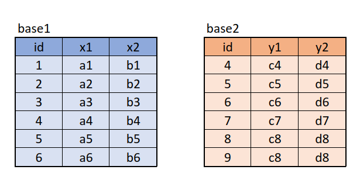
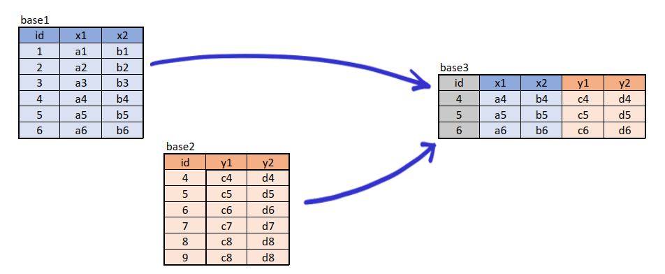
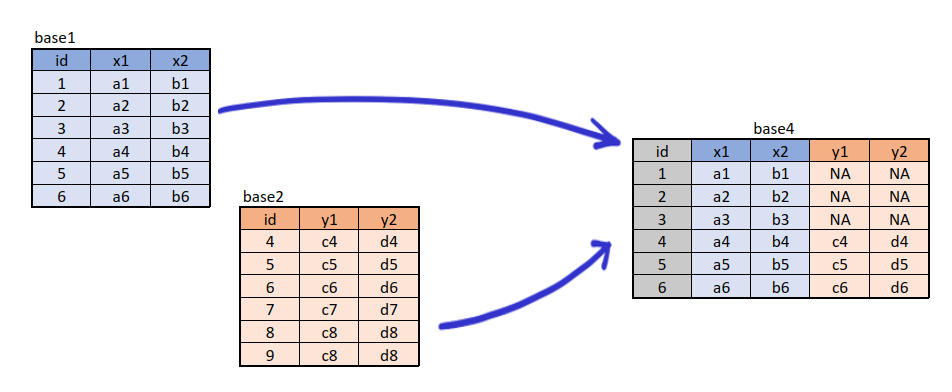
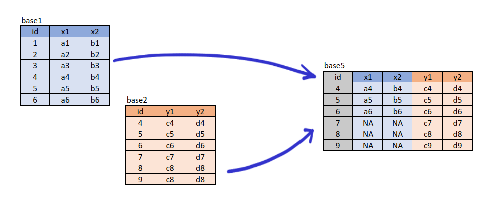
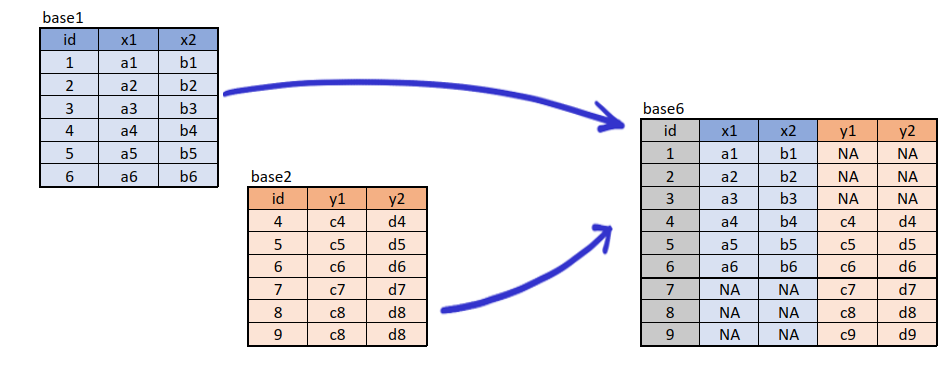
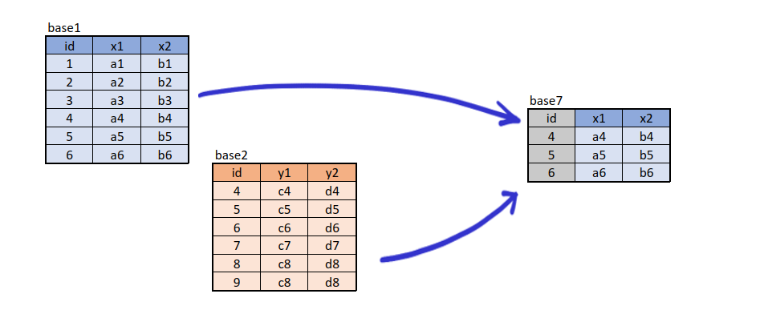
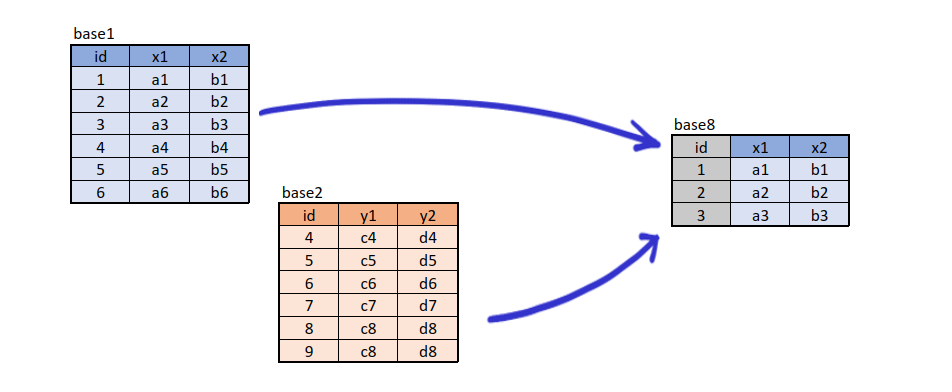

```{r setup, include=FALSE}
knitr::opts_chunk$set(echo = TRUE, comment = NA)
#Colombia<-readRDS("/home/deg/Documentos/Javeriana/Ms en Ciencia de Datos/repository/dataset/Colombia.RDS")


# Carga las librerías
library(knitr)
library(kableExtra)
library(dplyr)
```


<br/><br/><br/>

## **Combinación de bases de datos**

El paquete **dplyr** de R proporciona varias funciones relacionadas con la mezcla de bases de datos, como: 

* **inner_join**, 
* **left_join**, 
* **right_join**, 
* **full_join**, 
* **semi_join** y 
* **anti_join**. 

Estas funciones te permiten combinar bases de datos en función de una o varias columnas compartidas. A continuación, te mostraré cómo se utilizarían estas funciones en el escenario que mencionaste y cómo quedarían las bases resultantes.

Supongamos que tienes la siguiente configuración de bases de datos:

<br/><br/><br/>

```{r, echo=FALSE, out.width="70%", fig.align = "center"}
 
```

```{r, eval=FALSE}
library(dplyr)

base1=data.frame(id =c(1,2,3,4,5,6),
                 x1=c("a1","a2","a3","a4","a5","a6"),
                 x2=c("b1","b2","b3","b4","b5","b6"))

base2=data.frame(id =c(4,5,6,7,8,9),
                 y1=c("c4","c5","c6","c7","c8","c9"),
                y2=c("d4","d5","d6","d7","d8","d9"))
```


Ahora, vamos a aplicar las distintas funciones de unión para combinar estas bases de datos:

<br/><br/><br/>

### **inner_join** : 

Devuelve solo las filas que tienen valores coincidentes en ambas bases de datos, en función de la columna "id".


```{r, echo=FALSE, out.width="100%", fig.align = "center"}
 
```


```{r, eval=FALSE}
base3 <- dplyr::inner_join(base1,base2, by ="id") 
```

<br/><br/><br/>

### **left_join**  

Devuelve todas las filas de la base de datos izquierda (base1) y las filas coincidentes de la base de datos derecha (base2).


```{r, echo=FALSE, out.width="100%", fig.align = "center"}
 
```

```{r, eval=FALSE}
base4 <- dplyr::left_join(base1,base2, by ="id") 
```


<br/><br/><br/>

###  **right_join** 

Devuelve todas las filas de la base de datos derecha (base2) y las filas coincidentes de la base de datos izquierda (base1).


```{r, echo=FALSE, out.width="100%", fig.align = "center"}
 
```

```{r, eval=FALSE}
base5 <- dplyr::right_join(base1,base2, by ="id") 
```


<br/><br/><br/>

### **full_join** 

Devuelve todas las filas de ambas bases de datos, uniendo las filas coincidentes en función de la columna "id". Si no hay coincidencias, se agregan valores NA en las columnas correspondientes.

```{r, echo=FALSE, out.width="100%", fig.align = "center"}
 
```
```{r, eval=FALSE}
base6 <- dplyr::full_join(base1,base2, by ="id") 
```

<br/><br/><br/>

### **semi_join** 

Devuelve las filas de la base de datos izquierda (base1) que tienen valores coincidentes en la base de datos derecha (base2), en función de la columna "id".

```{r, echo=FALSE, out.width="100%", fig.align = "center"}
 
```

```{r, eval=FALSE}
base7 <- dplyr::semi_join(base1,base2, by ="id") 
```

<br/><br/><br/>

### **anti_join** 

Devuelve las filas de la base de datos izquierda (base1) que no tienen valores coincidentes en la base de datos derecha (base2), en función de la columna "id".

```{r, echo=FALSE, out.width="100%", fig.align = "center"}
 
```

```{r, eval=FALSE}
base8 <- dplyr::anti_join(base1,base2, by ="id")
```

<br/><br/><br/>

### **Resumen código R**

```{r, eval=FALSE}
library(dplyr)

base1=data.frame(id =c(1,2,3,4,5,6),
                 x1=c("a1","a2","a3","a4","a5","a6"),
                 x2=c("b1","b2","b3","b4","b5","b6"))

base2=data.frame(id =c(4,5,6,7,8,9),
                 y1=c("c4","c5","c6","c7","c8","c9"),
                y2=c("d4","d5","d6","d7","d8","d9"))

# inner_join ------------------------------------------
base3 <- dplyr::inner_join(base1,base2, by ="id") 
# base3

# left_join ------------------------------------------
base4 <- dplyr::left_join(base1,base2, by ="id") 
# base4


# right_join ---------------------------------------
base5 <- dplyr::right_join(base1,base2, by ="id") 
# base5


# full_join --------------------------------------
base6 <- dplyr::full_join(base1,base2, by ="id") 
# base6

# semi_join --------------------------------------
base7 <- dplyr::semi_join(base1,base2, by ="id") 
# base7


# anti_join --------------------------------------
base8 <- dplyr::anti_join(base1,base2, by ="id") 
# base8

```


