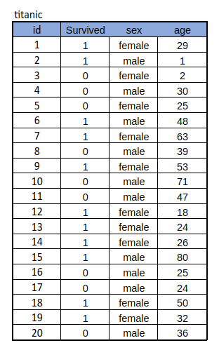
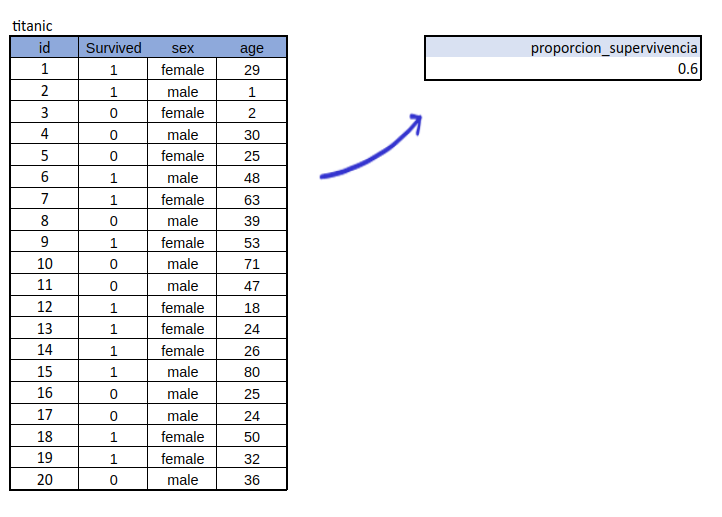
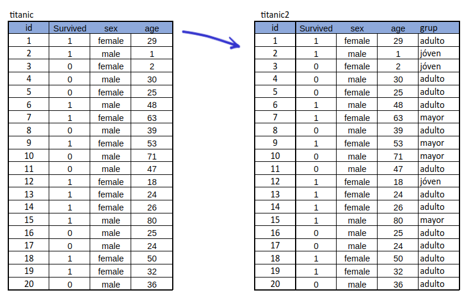
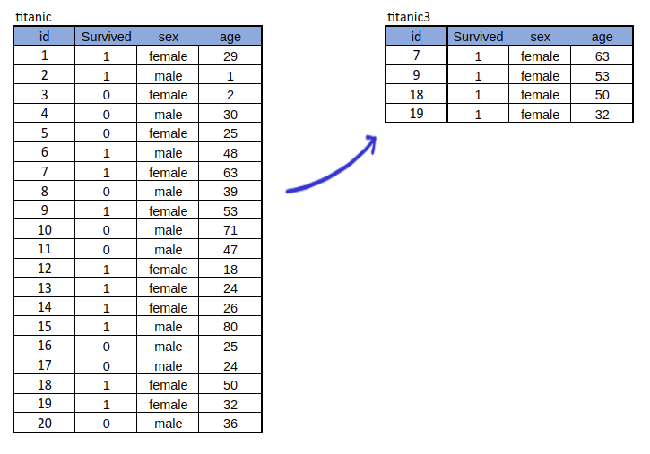
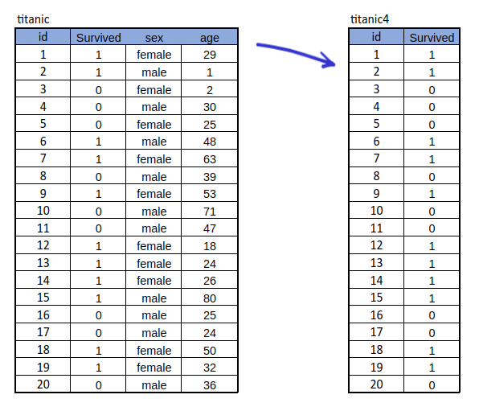

```{r setup, include=FALSE}
knitr::opts_chunk$set(echo = TRUE, comment = NA)
#Colombia<-readRDS("/home/deg/Documentos/Javeriana/Ms en Ciencia de Datos/repository/dataset/Colombia.RDS")


# Carga las librerías
library(knitr)
library(kableExtra)
library(dplyr)
```


<br/><br/><br/>

El paquete **dplyr** de R proporciona varias funciones para manipular y transformar datos enmarcados en data frames. Dentro de las funciones mas usadas están:
  

* **summarize**, 
* **mutate**, 
* **select** y 
* **filter**:

<br/><br/>

Para ilustrar su uso tomaremos una muestra de tamaño 20 de la base Titanic de [*kaggle*](https://www.kaggle.com/datasets/yasserh/titanic-dataset)

```{r, echo=FALSE, out.width="35%", fig.align = "center", warning=FALSE, message=FALSE}
 
```

<br/><br/>


### **summarize**: 
Esta función se utiliza para resumir los datos y calcular estadísticas agregadas. Permite calcular valores resumidos como la suma, promedio, mediana,  mínimo,  máximo, entre otros indicadores, en función de grupos o condiciones específicas.

<br/><br/>


```{r, eval=FALSE}
library(dplyr)
titanic %>%
  summarize(proporcion_supervivencia = mean(survived))
```

<br/><br/>

```{r, echo=FALSE, out.width="85%", fig.align = "center", warning=FALSE, message=FALSE}
 
```

<br/><br/>


### **mutate**: 
La función mutate se utiliza para crear nuevas variables  en un data frame, basándose en variables existentes o aplicando transformaciones a las variables existentes. Puede usarse  para realizar cálculos en variables  existentes, agregar valores calculados o transformar datos de diversas maneras.

<br/><br/>


```{r, eval=FALSE}
titanic2 <- titanic %>%
  mutate(grup = case_when(
    age <= 18 ~ "jóven",
    age <= 50 ~ "adulto",
    TRUE ~ "mayor"
  ))

```

<br/><br/>


```{r, echo=FALSE, out.width="90%", fig.align = "center", warning=FALSE, message=FALSE}
 
```

<br/><br/>


### **select**: 
Esta función se utiliza para seleccionar un subconjunto de variables  de un data frame. Puedes elegir variables  específicas o excluir variables  no deseadas. La función select también permite realizar transformaciones en las variables  seleccionadas, como cambiar el nombre de las variables o calcular nuevas variables.


<br/><br/>

```{r,eval=FALSE}
titanic4 <- titanic %>%
  filter(sex == "female", age >= 30)
```

<br/><br/>

```{r, echo=FALSE, out.width="88%", fig.align = "center", warning=FALSE, message=FALSE}
 
```

<br/><br/>


### **filter**: 
La función filter se utiliza para filtrar filas de un data frame en función de condiciones específicas. Puedes establecer condiciones lógicas para seleccionar solo los registros (filas) que cumplan con dichas condiciones. Por ejemplo, puedes filtrar los registros (filas) que cumplen una condición numérica, de texto o basada en una fecha.


<br/><br/>


```{r, eval=FALSE}
titanic3 <- titanic %>%
  select(id, survived)
```

<br/><br/>

```{r, echo=FALSE, out.width="75%", fig.align = "center", warning=FALSE, message=FALSE}
 
```


