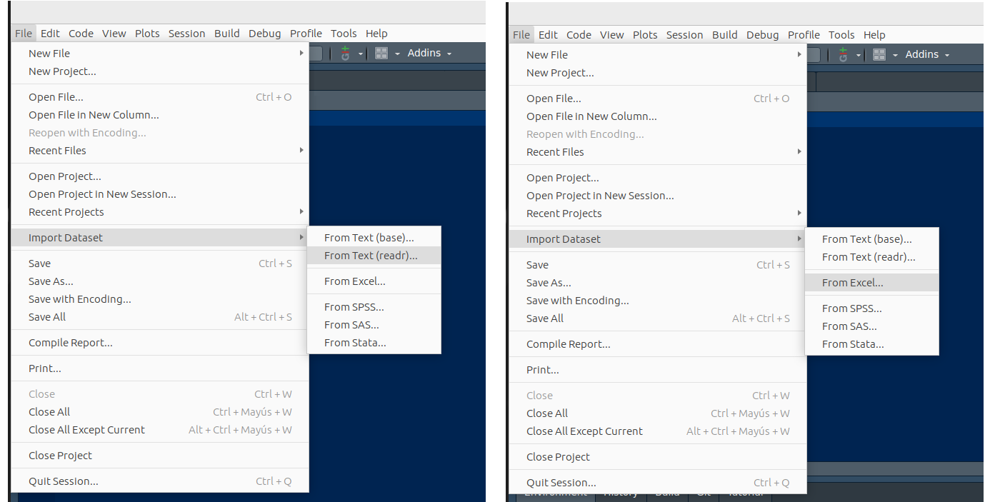

```{r setup, include=FALSE}
knitr::opts_chunk$set(echo = TRUE)
```


<br/><br/>

La importación de datos es una fase crucial en el proceso de análisis de datos en el ámbito de las ciencias de datos. En R, existen varias paquetes diseñados para facilitar este proceso ante  una variedad de fuentes  y formatos, como archivos de texto, hojas de cálculo, bases de datos, e incluso servicios en línea. La elección del método de importación dependerá del formato específico en el que se encuentren los datos y de las necesidades particulares del análisis.

<br/>

A continuación se presentan algunas formas de realizar este proceso :

<br/>

1. Utilizando el menú RStudio 

+ Caso formato .csv : *File /Import Dataset/From text*. 

+ Caso formato .xlsx : *File/ Import Dataset/ From Excel*. 


```{r, echo=FALSE, out.width="100%", fig.align = "center"}

```
  

<br/>

2. Utilizando el paquete Rcmdr y RcomdrMisc que activa una interfas de R que trabaja con menus y ventanas con un proceso parecido al anterio

Los anteriores caso implican que tengamos la base de datos descargada en una carpeta de nuestro PC

<br/>

3. Podemos importar la base de datos de un repositorio que maneje API que es un permiso a traves de un token. En este caso debemos solicitar el token e instalar el paquete RSocrata

<br/>

<pre>
install.packages("RSocrata", dependencies = TRUE)   
library(RSocrata)    
token <- "zxMsD6eXc0zlEMryRGW87Hwrz"  
Colombia <- read.socrata("https://www.datos.gov.co/resource/gt2j-8ykr.json", app_token = token) 
</pre>

<br/>

Este proceso tarde unos minutos pues  la base es grande

<br/>

Para guardar el archivo en un PC, es recomendable utilizar el formarto RDS que ocupa menos espacio. En este caso se guarda el archivo con el nombre de *Colombia.RDS* en la carpeta *data/*

<pre>
saveRDS(Colombia, file = "data/Colombia23.RDS") 
</pre>

<br/>

4. Podemos trabajar con Dataset disponible en los paquetes de R. Para ello solo utilizamos la función data

<pre>
data(iris)  # data set iris
data(cars)  # data set cars
</pre>


Una función que ayuda a escribir la ruta en donde tenemos el archivo a importar es la función :`file.choose. Al ejecutarla abre una ventana que nos permite localizar el archivo a, para luego copiando la ruta obtenida con Ctrl+C, como parámetro de la función adecuada.


<pre>
file.choose()
</pre>

En mi caso se genera la ruta "data/Colombia.RDS"


<pre>
Colombia<- readRDS("data/Colombia23.RDS")
</pre>

<br/><br/>
